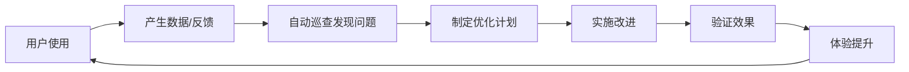

# RAG Pro Max 持续质量巡查与迭代优化 SOP

## 🎯 角色定位与目标

**角色**: 资深技术项目经理（TPM）+ 系统架构师  
**目标**: 建立"持续质量巡查与迭代优化"的闭环管理机制  
**核心理念**: 数据驱动的飞轮效应 - 越用越好的良性循环

## 🔄 良性循环机制（The Flywheel）



### 飞轮驱动逻辑
- **输入**: 用户使用日志、报错信息、性能数据、显性反馈
- **转化**: 系统自动识别痛点和高频路径
- **输出**: 针对性修复和优化
- **结果**: 体验改善 → 使用增加 → 数据更多 → 优化更精准

---

## 📋 四步循环 SOP（PDCA模式）

### 第一步：持续巡查 (Monitor & Inspect)

#### 🤖 自动化巡查（24/7运行）

**日志聚合与异常监控**
```bash
# 部署监控脚本
./scripts/deploy_monitoring.sh

# 关键指标
- ERROR级别异常 > 10次/小时 → 立即告警
- API响应时间 > 2秒 → 性能告警  
- 内存使用率 > 85% → 资源告警
- 磁盘空间 < 10% → 存储告警
```

**健康检查脚本**
```python
# 每日冒烟测试
python scripts/daily_health_check.py
# 检查项：
# ✓ 核心API可用性
# ✓ 数据库连接
# ✓ 文件上传功能
# ✓ 知识库查询
```

#### 👥 人工巡查（每周执行）

**代码质量审查**
- [ ] 检查新增代码的复杂度（McCabe < 10）
- [ ] 识别重复代码块（DRY原则）
- [ ] 评估技术债务积累情况

**用户反馈分析**
- [ ] 整理GitHub Issues按优先级分类
- [ ] 分析用户使用路径和痛点
- [ ] 收集功能需求和改进建议

### 第二步：优化决策 (Plan & Prioritize)

#### 问题分类矩阵

| 优先级 | 类型 | 响应时间 | 示例 |
|--------|------|----------|------|
| P0 | 阻断性Bug | 2小时内 | 系统崩溃、数据丢失 |
| P1 | 性能/体验 | 1周内 | 查询慢、界面卡顿 |
| P2 | 功能优化 | 1月内 | 新功能、UI改进 |
| P3 | 技术债务 | 季度内 | 代码重构、架构优化 |

#### 制定执行方案

**技术方案模板**
```markdown
## 问题描述
- 现状：查询平均响应时间3秒
- 影响：用户体验差，跳出率高

## 解决方案
- 方案：优化向量检索算法
- 预期：响应时间降至1秒以内
- 风险：可能影响检索准确性

## 实施计划
- 开发时间：3天
- 测试时间：2天
- 上线时间：本周五
```

### 第三步：实施执行 (Execute & Implement)

#### 开发规范

**分支管理策略**
```bash
# 功能开发
git checkout -b feature/optimize-search-speed
git commit -m "feat: 优化向量检索算法"
git push origin feature/optimize-search-speed

# 代码审查后合并
git checkout main
git merge feature/optimize-search-speed
```

**原子化提交原则**
- 每个commit只做一件事
- 提交信息遵循约定式提交规范
- 包含必要的测试用例

**文档同步更新**
- [ ] 更新API文档
- [ ] 修改用户手册
- [ ] 记录配置变更

### 第四步：验证复盘 (Verify & Review)

#### 🔍 自动化验证

**性能基准测试**
```python
# 运行性能对比
python scripts/benchmark_comparison.py
# 输出：
# 优化前：平均响应时间 3.2s
# 优化后：平均响应时间 0.8s
# 提升：75% ✅
```

**回归测试**
```bash
# 运行完整测试套件
python -m pytest tests/ -v
# 覆盖率要求：> 80%
```

#### 👥 人工验证

**灰度测试流程**
1. 内部测试（1天）
2. 小范围用户测试（3天）
3. 全量发布

**复盘三问**
1. ✅ 预期指标达成了吗？
2. ⚠️ 有没有引入新问题？
3. 🚀 下次如何做得更好？

---

## 📊 可视化管理看板

### 看板结构（推荐使用GitHub Projects）

| 待巡查 | 计划中 | 进行中 | 待验证 | 已完成 |
|--------|--------|--------|--------|--------|
| [自动] 昨晚数据库超时3次 | 优化SQL查询语句 | 重构数据解析模块 | 压力测试 | v1.2发布 |
| [用户] 建议增加夜间模式 | 设计夜间模式UI | | | |

### 关键指标仪表板

```python
# 每日指标报告
{
  "date": "2026-01-01",
  "metrics": {
    "system_health": "🟢 良好",
    "response_time": "0.8s (-75%)",
    "error_rate": "0.1% (-90%)",
    "user_satisfaction": "4.2/5 (+0.3)"
  },
  "active_issues": 3,
  "completed_optimizations": 5
}
```

---

## 🛠️ 实施工具链

### 监控工具
- **日志**: ELK Stack / Grafana Loki
- **性能**: Prometheus + Grafana
- **异常**: Sentry
- **健康检查**: 自定义Python脚本

### 项目管理
- **看板**: GitHub Projects / Trello
- **文档**: Notion / GitBook
- **沟通**: Slack / 钉钉

### 自动化工具
- **CI/CD**: GitHub Actions
- **测试**: pytest + coverage
- **代码质量**: SonarQube / CodeClimate

---

## 🎯 成功指标（KPI）

### 技术指标
- 系统可用性 > 99.5%
- 平均响应时间 < 1秒
- 错误率 < 0.5%
- 代码覆盖率 > 80%

### 业务指标
- 用户满意度 > 4.0/5
- 功能使用率提升 > 20%
- 问题解决时间 < 24小时
- 新功能采用率 > 60%

### 流程指标
- 巡查覆盖率 100%
- 计划执行率 > 90%
- 按时交付率 > 85%
- 复盘完成率 100%

---

## 🚀 启动清单

### 第一周：基础设施搭建
- [ ] 部署监控系统
- [ ] 设置告警规则
- [ ] 创建项目看板
- [ ] 制定SOP文档

### 第二周：流程试运行
- [ ] 执行首次巡查
- [ ] 识别3-5个优化点
- [ ] 完成一个完整PDCA循环
- [ ] 收集流程反馈

### 第三周：优化迭代
- [ ] 根据反馈调整流程
- [ ] 自动化更多检查项
- [ ] 建立定期复盘机制
- [ ] 培训团队成员

---

通过这套SOP，RAG Pro Max将建立起自我进化的能力，实现"越用越好"的良性循环！
